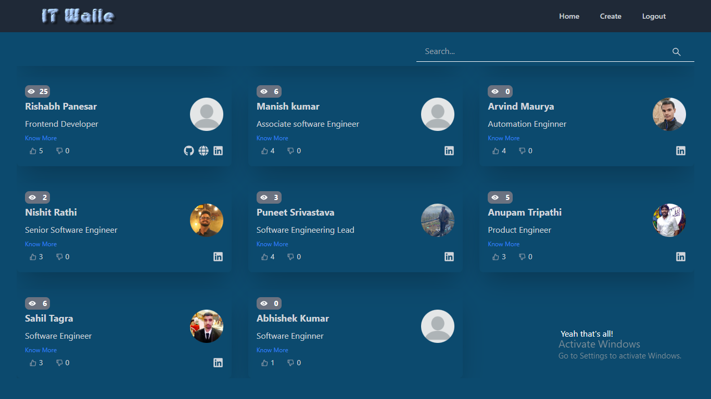
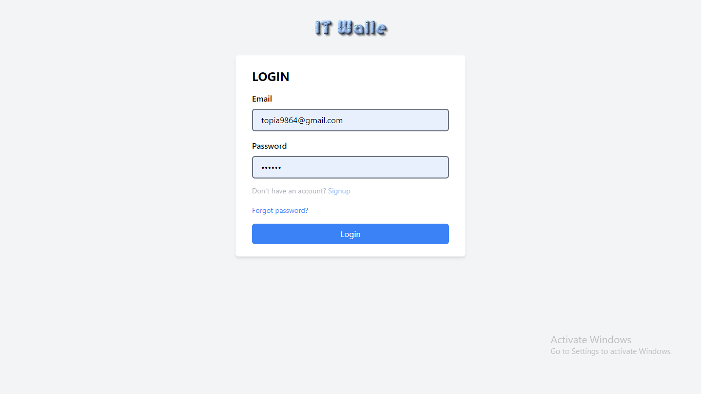

# IT Walle
It is a record-book for IT peopel through you can find any IT Professional Details and their social links with authentication.

## Acknowledgements

**vercel link of our project**: (https://crud-app-lemon.vercel.app/)

**backend link of our project**: (https://github.com/prabhattopi/curdAppbackend)

## Author:
- [Prabhat Singh](https://github.com/prabhattopi)

## Tech Stack:

<h1>Snapshots of my project</h1>

1. Landing page
 

2. Login Page

<!-- 3. Search bar

 

4. Product Page

 

5. Cart

   -->

